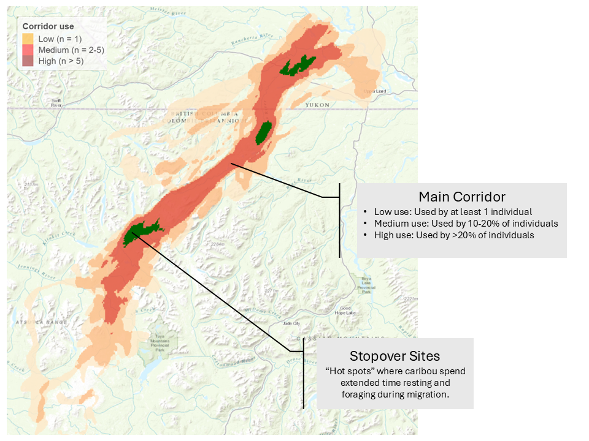

## Identifying seasonal migration corridors

The process for mapping and classifying seasonal migration corridors involves four primary steps:

**1. Identify migration periods**

To understand when an individual caribou is actually migrating (instead of just wandering around its seasonal range), we looked at how far it moves from a starting point over time. Using the Net Squared Displacement (NSD) method, which measures the straight-line distance an animal travels from a fixed starting point, we identified when an individual:

- Leaves its winter or summer range,
- Travels in a clear direction, and
- Settles into the next seasonal range.

These "breakpoints" identify the start and end of each migration period. We identified them using the Movement Mapper app.

**2. Map each caribou's route**

Instead of simply connecting caribou locations with a line, we used the Brownian Bridge Movement Model (BBMM) to create a more realistic "heat map" that highlights the areas an individual used most during its migration. Specifically, the map shows:

- The likely corridor an individual followed, and
- Where it spent extra time resting or feeding (stopovers).

**3. Combine individual routes**

To understand the movement the entire herd, we combined (stacked) individual maps through a three-step averaging process:
1. Average each individual's migration paths over multiple years (e.g., 2020-26);
2. Identify the main area (footprint) where each caribou usually travels, typically representing the area containing 95-99% of its probable locations;
3. Combine all individuals’ footprints on top of one another to show how many different individuals passed through any given area (e.g., a 50m pixel).

**4. Classify migration corridors**

The final step is to classify the stacked maps (seasonal corridors) based on how heavily they were used:

- Low use – at least one caribou passed through
- Medium use – used by 10–20% of individuals
- High use – used by more than 20% of individuals

We also identified key stopovers where caribou consistently paused to rest and feed. These are important areas to protect within the seasonal corridors.

 
